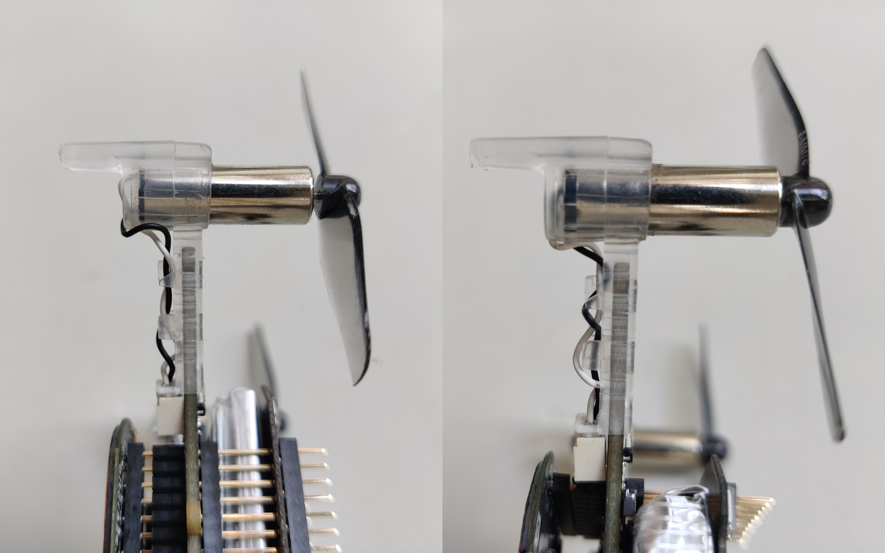
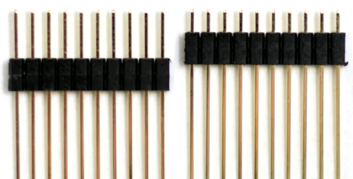

# Crazyflie setup

## Drone assembly

See the [parts list](PARTS.md) for a detailed list of required components.

On the [bitcraze website](https://www.bitcraze.io/documentation/tutorials/getting-started-with-crazyflie-2-x/) you can find the detailed procedure for assembling a Crazyflie. We use some different parts than those provided in the standard Crazyflie package, so make sure to read the comments below before starting assembling the drones. Otherwise you need to disassemble them again.

- To be able to handle the (relatively heavy) charging deck, the thrust upgrade is required. This includes the larger motors and larger propellers. Be carefull when attaching the propellers to the motor not to press out the back of the motor. When attaching the propeller, hold the back part of the motor. We have noticed that the back part of the larger motor comes loose more easily than the smaller motors. Therefore it is also adviced to check each motor of every drone ones in a while or after a crash to make sure all motors are still in good shape. See the image below on how to spot the difference. On the left, the back part of the motor is correctly in place, on the right, the back part has come out slightly. If this happens, you can use a small stick like thing (e.g., pen, small inbus key, chopstick) to push the black part back into place while holding the casing of the motor with the other hand.


- The larger propellers don't have an A an B label to show which side of the Crazyflie they have to be attached to. Therefore, look at the small arrow on the motor arm of the main Crazyflie board to see in which direction the motor will spin.

- To fit the charging deck, lighthouse deck, and battery on the Crazyflie, longer male headers are required. The shorter side of the headers can be pressed into the black part even more to allow more room for the battery (see image below). This can be easily done by holding the black plastic part and pressing the shorter side into a table.


- To accompany the larger motors (and their larger current draw), larger batteries are advised. The standard batteries are 250mAh, but we have noticed that these sometimes don't deliver enough current to the motors at take off. Switching to 300mAh batteries solves this issue.

## Firmware

### Update firmware and lighthouse deck

Upload the newest firmware to the Crazyflies using the cfclient by following this [tutorial](https://www.bitcraze.io/documentation/repository/crazyflie-clients-python/master/userguides/userguide_client/#firmware-upgrade). Make sure to attach the lighthouse deck but **not** the charging deck. Attaching the charging deck while updating the firmware will sometimes result in not detecting the lighthouse deck, and thus not updating the firmware of the lighthouse deck.

### Set URI

This code base has been built around a Crazyflie URI that starts with `247E`. Therefore, it is important to follow the same convention (This will probably become more flexible in a future release of this repository). See the following examples:

| Drone number | URI |
|---|---|
| 1 | 247E000001 |
| 2 | 247E000002 |
| 9 | 247E000009 |
| 10 | 247E000010 |
| 11 | 247E000011 |
| 35 | 247E000035 |

The uri of a Crazyflie can be set through the cfclient.

### Set radio channels

The radio channel of each drone has to be set as well (through the cfclient). You can choose yourself which channels to use but each radio needs to have a different channel. A group of drones with the same channel need to have consecutive numbers. For example, if you choose to have 5 drones per radio, then drone 1, 2, 3, 4, and 5 need to be set to the same channel. drones 6, 7, 8, 9, 10 have to be set to a different channel. These channels have to be configured in [config.py](ros2_ws/src/swarm_operation/swarm_operation/config.py).

### Flash custom firmware

To be able to switch between yaw control and no yaw control, we have changed some lines in the crazyflie firmware. First follow [this page](https://www.bitcraze.io/documentation/repository/crazyflie-firmware/master/building-and-flashing/build/) for more information on how to flash custom firmware.

The following changes have to be made in the Crazyflie firmware (Release 2023.07):

In `src/modules/src/crtp_commander_generic.c` change lines 112-114
```cpp
setpoint->mode.yaw = modeVelocity;

setpoint->attitudeRate.yaw = -values->yawrate;
```
to
```cpp
setpoint->mode.yaw = modeAbs;
setpoint->attitude.yaw = values->yawrate;
```
This will change the yaw input of the velocity commander to absolute yaw (instead of yawrate)

&nbsp;

In `src/modules/src/controller/controller_pid.c` change line 83
```cpp
attitudeDesired.yaw = setpoint->attitude.yaw;
```
to
```cpp
if (setpoint->attitude.yaw < (float)400) {
	attitudeDesired.yaw = setpoint->attitude.yaw;
}
```
This will result in absolute yaw control of values below 400 and zero yawrate otherwise.

&nbsp;

We have noticed that the yaw control can be quite fast because of the thrust upgrade, therefore we reduced the yaw gains (we just halfed the default values, feel free to play around with this).

And in `crazyflie-firmware/src/platform/interface/platform_defaults_cf2.h` change lines 76-78
```cpp
#define PID_YAW_KP  6.0
#define PID_YAW_KI  1.0
#define PID_YAW_KD  0.35
```
to
```cpp
#define PID_YAW_KP  3.0
#define PID_YAW_KI  0.5
#define PID_YAW_KD  0.18
```

After making these changes, flash the new firmware to all drones using the steps described in the previously mentioned page. If the original firmware is used with the default config settings of this ROS package, the drones will spin rapidly after take off (a yawrate of 400 will be received). Therefore, a good check if the changes were implemented correctly is to see if the drones spin after take off or not (they shouldn't).