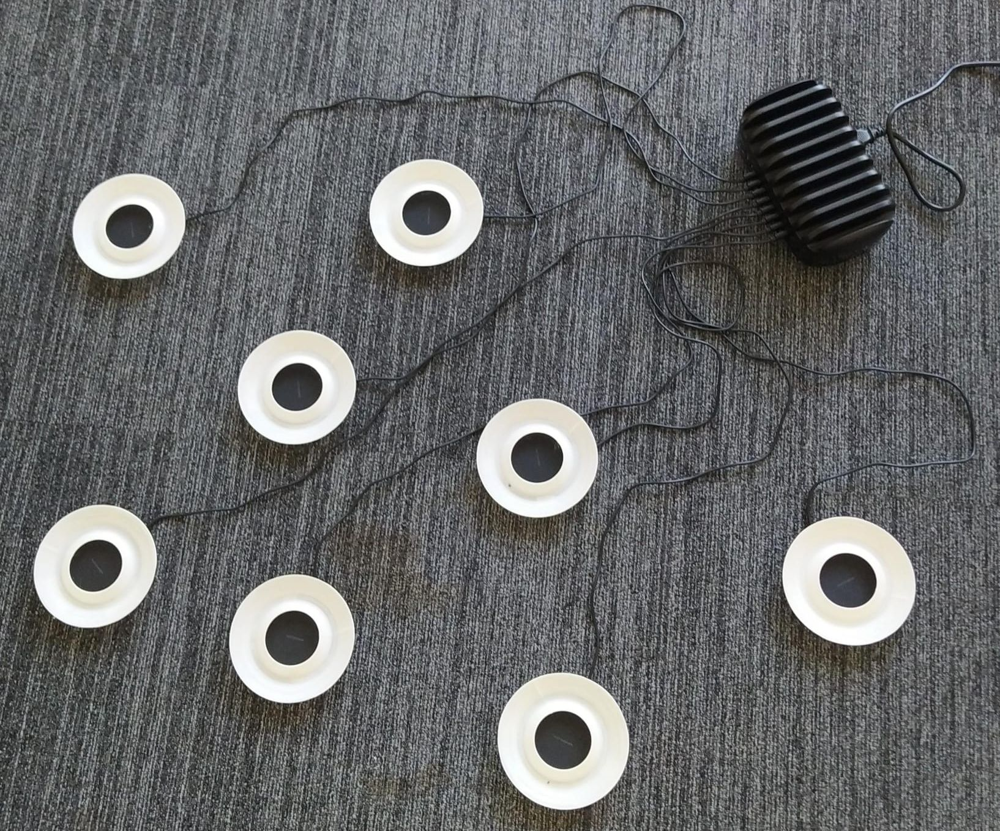
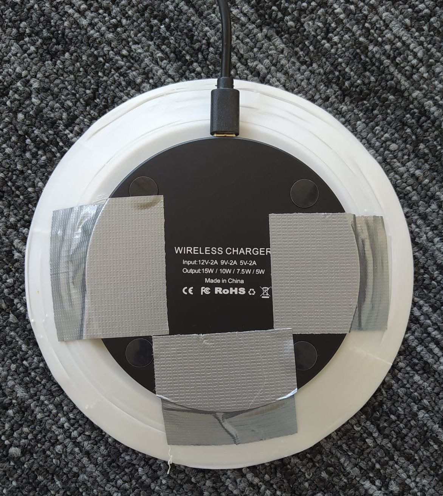

# Landing pad setup

When the drones are fully assembled, the swarm can be set up. This means, providing a landing/charging pad for each drone.

The landing pads are made of two parts, the charger and the drone holder. The charger is a standard wireless phone charger (in our case the [Nuvance wireless charger](https://www.bol.com/nl/nl/p/nuvance-draadloze-oplader-15w-inclusief-kabel-wireless-charger-fast-charger-iphone-en-samsung/9300000093210477/?s2a=)), and the drone holder is a 3d printed rim (see [landing_pad.stl](Landing_pad.stl)) that allows for passive centering of the drone on the pad. When the drone lands off-center, it will slide towards the center of the pad.

The 3D printed charging pads are currently attached using tape (see picture below). This design choice was made to reduce the printing time and PLA required. We did notice that the pads get loose over time so feel free to modify the design as you wish.

The position of the landing pads is not that important as the drones will send their initial position if they are charging to save the location of the pads. During landing, a distance check is performed to make sure that no two drones will land closer than 30cm (can be changed in the config file).