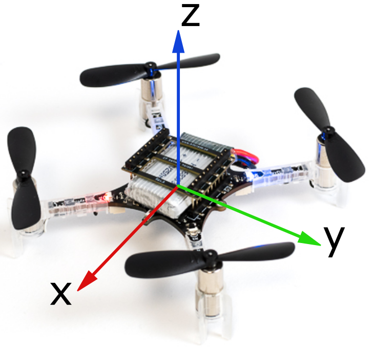

# Lighthouse base station setup

See the [Bitcraze website](https://www.bitcraze.io/documentation/tutorials/getting-started-with-lighthouse/) for detailed instructions on how to setup the lighthouse base stations.

The orientation of the Crazyflie during callibration will determine the orientation of the coordinate frame. The blue leds represent the back of the drone. The front is facing in the positive x-direction, z is upwards, and following a right hand axis system, positive y is pointed to the left (when looking in the positive x-direction). See the image below for a visual explanation.

After callibrating the base stations using a Crazyflie to define the origin of the coordinate frame, click the `Save system config` button in the `Lighthouse Positioning` tab. Copy the contents of this file into [configuration.yaml](configuration.yaml).

To send the geometry data of the base station setup to all drones, position all drones in the flight arena with about 30cm spacing between them (the drones will take off and land with some drift at the end of this procedure), and run [upload_lh_config.py](upload_lh_config.py). Change the drone indices and radio channel to your needs.

After the upload is complete, the drones will take off, hover for a few seconds, and land. This allows you to quickly see if the position estimation is stable. If not, redo the calibration as described on the [Bitcraze website](https://www.bitcraze.io/documentation/tutorials/getting-started-with-lighthouse/). You can ignore most error messages in the terminal when running [upload_lh_config.py](upload_lh_config.py), if the drones lift off and are stable, the upload was successful, if not, try uploading the configuration again to the drones that didn't take off.

Depending on your drone cage size, you want to set the bounds of the cage. In `247Swarm/ros2_ws/src/swarm_operation/swarm_operation/config.py` change the ABS_BOUNDS variable to your needs.