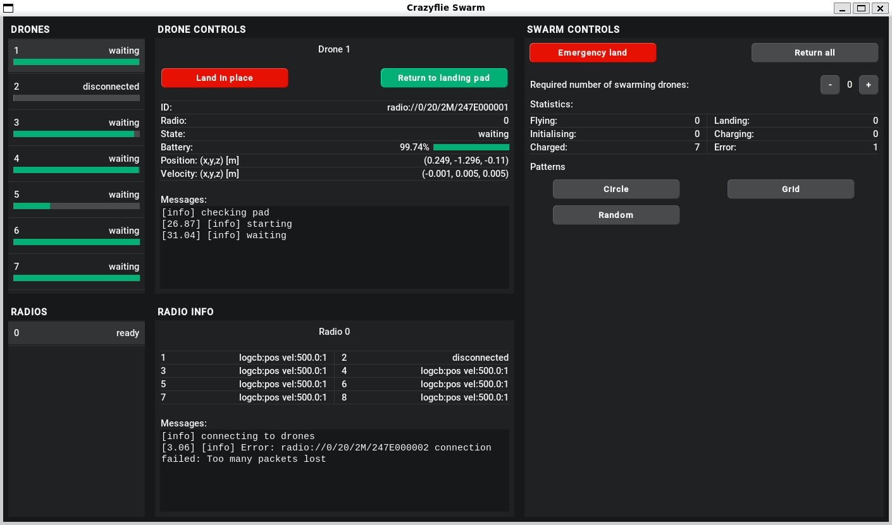

# !! In progress !!

We are getting this repository ready as fast as possible such that anyone can have their own swarm of crazyflies.

- Currently the collsion avoidance is missing, so you should only try this if your algorithm has collision avoidance built in.
- The setup of the swarm is still missing.
- The custom crazyflie firmware is missing

# 247Swarm

This is a ROS2 package to control a swarm of [crazyflies](https://www.bitcraze.io/) for research or outreach purposes. Developed by [Emergent Swarms](https://www.linkedin.com/company/emergentswarms) for Delft University of Technology.

Using the [wireless charging](https://www.bitcraze.io/products/qi-1_2-charger-deck/) deck on the crazyflies, this package takes care of automatically returning the drones to a landing pad when their battery is empy or when instructed to do so. Using a position or velocity commander, you can implement swarming algorithms without having to think about the battery live of the drones. Our collision avoidance package is provided which allows for carefree implementations of swarming algorithms. The collision avoidance can be disabled in case you want to design your own.


## Installation

This package is built on ROS2 humble. Visit their [installation page](https://docs.ros.org/en/humble/) for more information on the installation process.

### Windows
Running this package on windows requires the use of WSL (Ubuntu22.04). Visit [this page]() for more information on the installation process.

After installing ROS2 humble on WSL, clone this repository in WSL and navigate to `247Swarm/ros2_ws/` . Build the workspace by running:
```
colcon build --symlink-install
source ./install/setup.bash
```
Any time you edit launch or setup files, you are required to run these commands again.

### Linux (Ubuntu22.04)
Clone this repository in WSL and navigate to `247Swarm/ros2_ws/` . Build the workspace by running:
```
colcon build --symlink-install
source ./install/setup.bash
```
Any time you edit launch or setup files, you are required to run these commands again.


## Setting up the swarm

TODO: add documentation


## Usage

### Config file

Inside `ros2_ws/src/swarm_operation/swarm_operation/config.py` you can edit many parameters, e.g., example pattern, the number of drones, cage bounds, and collision avoidance.

At the top of the `config.py` file you can choose one of two pattern examples provided.
```
#################### Example patterns ####################
POS_EXAMPLE, VEL_EXAMPLE = "PositionCommanderExample", "VelocityCommanderExample"
COMMANDER = POS_EXAMPLE
```
`POS_EXAMPLE` will organise the drones into a grid formation with a size depending on the number of drones in the swarm. `VEL_EXAMPLE` will result in an orbit like motion of the drones about a point above the origin.

Depending on your swarm setup, the number of drones and number of drones per radio have to be changed.

### Launching
The package can be launched through `launch.py`:
```
ros2 launch swarm_operation launch.py
```
TODO: explain add and explain collision avoidance file
When using our collision avoidance, also run `collision_avoidance.exe`.

### GUI
Through the GUI you can keep track of the current state of the drones and radios, control how many drones enter and exit the swarm, and switch between custom patterns you added.



In the top left, a scrollable list of all the drones will appear after a connection is established. Here you can see the state of the drone and the battery level. Clicking on one of these drone cards will open up a detailed information panel in the top center.

Same holds for the radio list on the bottom left.

On the right, you can see the swarm control panel. Here you can add and rmove drones to the swarm, see the number of drones in various states, and switch between custom patterns.


## Custom swarming patterns/algorithms
As explained above, two example patterns are provided, using the position and velocity commander respectively. These examples can be found in `ros2_ws/src/swarm_operation/swarm_operation/examples/`.

These examples make use of the `SwarmController` class to control the swarm. Please use these examples as a reference to implement your own algorithms.
